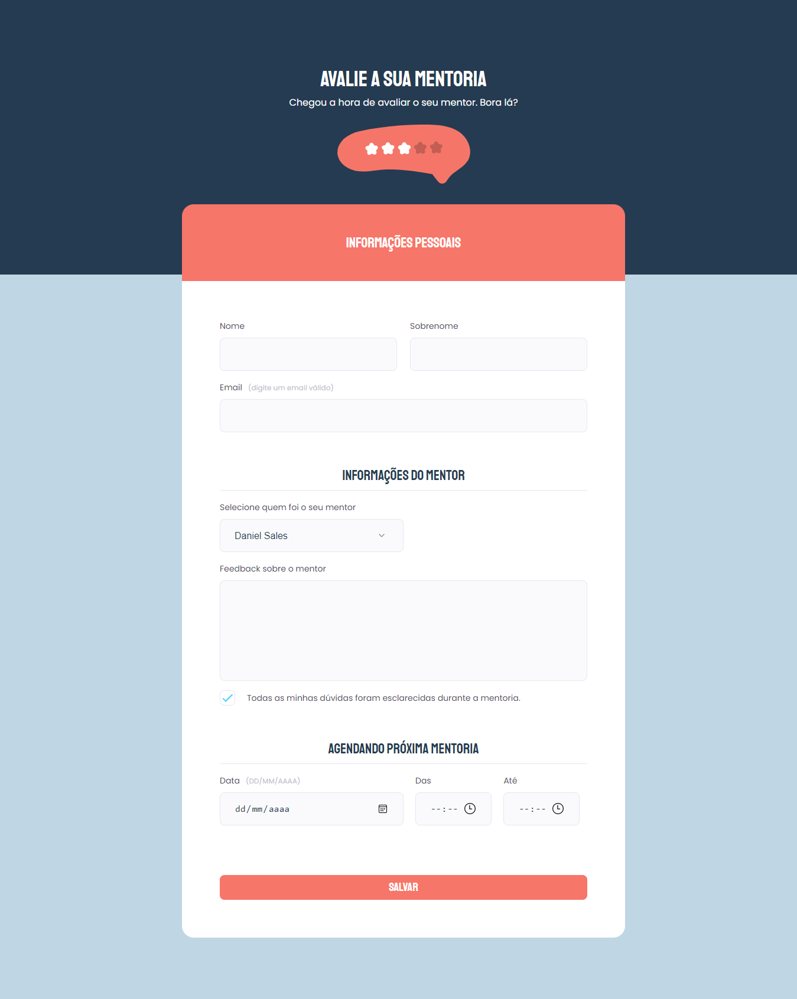

<h1 align="center"> Formulário de Feedback (Mentoria) </h1>

Projeto de um formulário para 💻 Desktop e 📱 Mobile , feito em conjunto com a Rocketseat 🚀 no módulo Avançando no HTML e CSS, do Explorer (stage-03). 

  <a href="#-tecnologias">Tecnologias</a>&nbsp;&nbsp;&nbsp;|&nbsp;&nbsp;&nbsp;
  <a href="#-projeto">Projeto</a>&nbsp;&nbsp;&nbsp;|&nbsp;&nbsp;&nbsp;
  <a href="#-layout">Layout</a>&nbsp;&nbsp;&nbsp;|&nbsp;&nbsp;&nbsp;
  <a href="#memo-licença">Licença</a>

  

 

  

## 🚀 Tecnologias

Esse projeto foi desenvolvido com as seguintes tecnologias:

- HTML
- CSS
- Github

## 💻 Projeto

O Formulario de feedback para uma mentoria. Esse projeto faz parte de um dos desafios da Rocketseat 🚀

## 🔖 Layout

Você pode visualizar o layout do projeto através [DESSE LINK](https://www.figma.com/file/fnZyJHs7eqNFAA7tUrKcsD/Stage-03---Formul%C3%A1rio-avan%C3%A7ado?node-id=0%3A1). É necessário ter conta no [Figma](https://figma.com) para acessá-lo.

## :memo: Licença

Esse projeto está sob a licença MIT.

---

Feito com ♥ by Daniel Sales/Rocketseat :wave: [Participe da  comunidade!](https://discord.gg/rocketseat)
